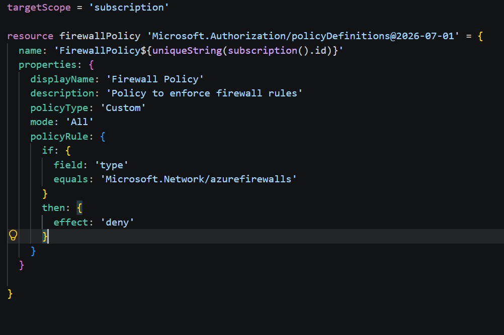
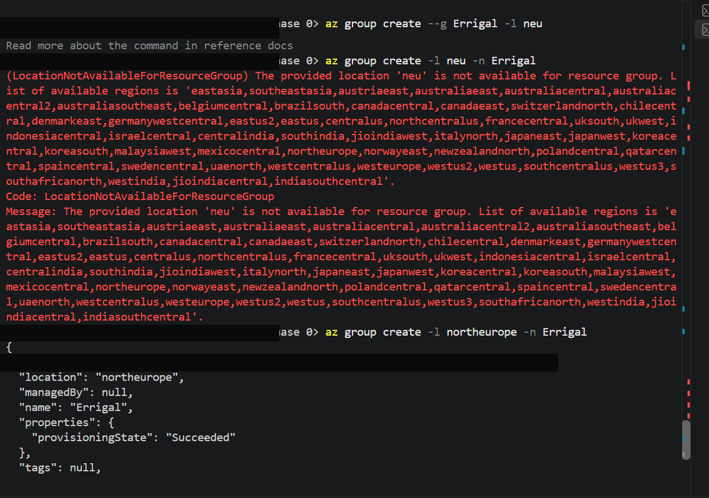
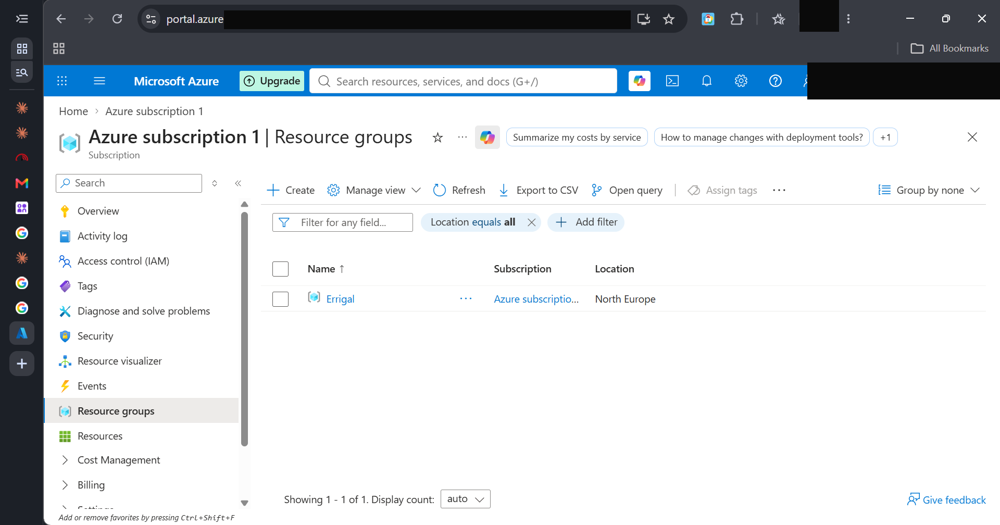
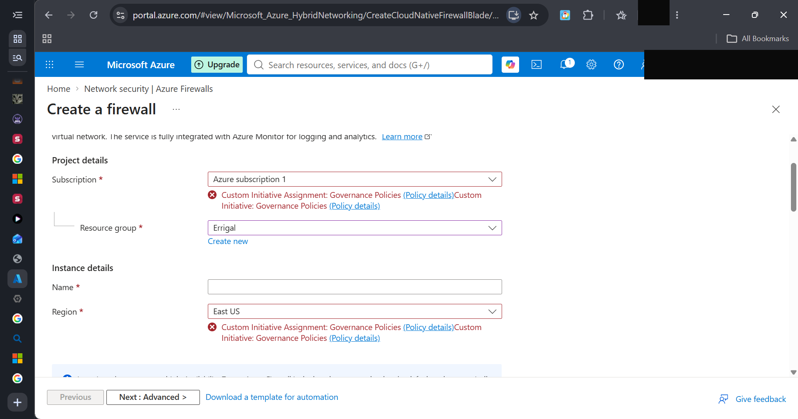
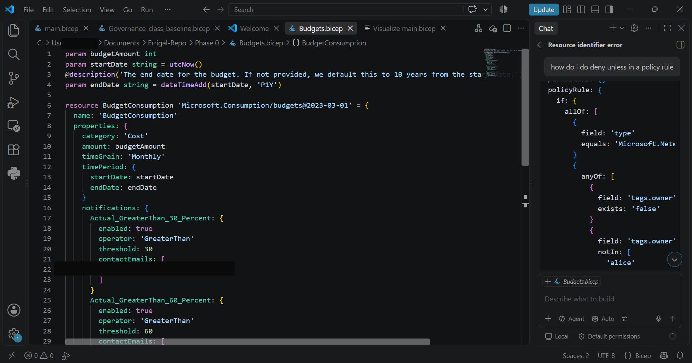
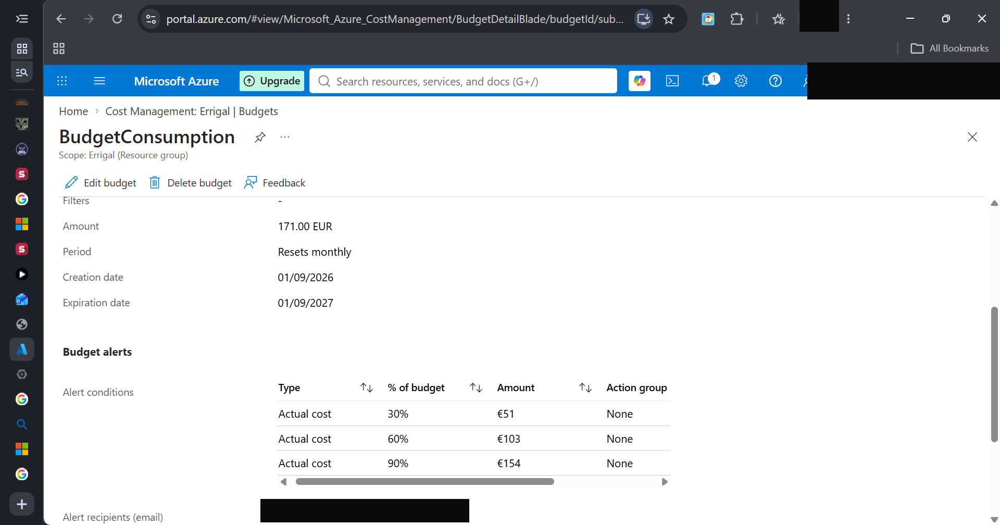
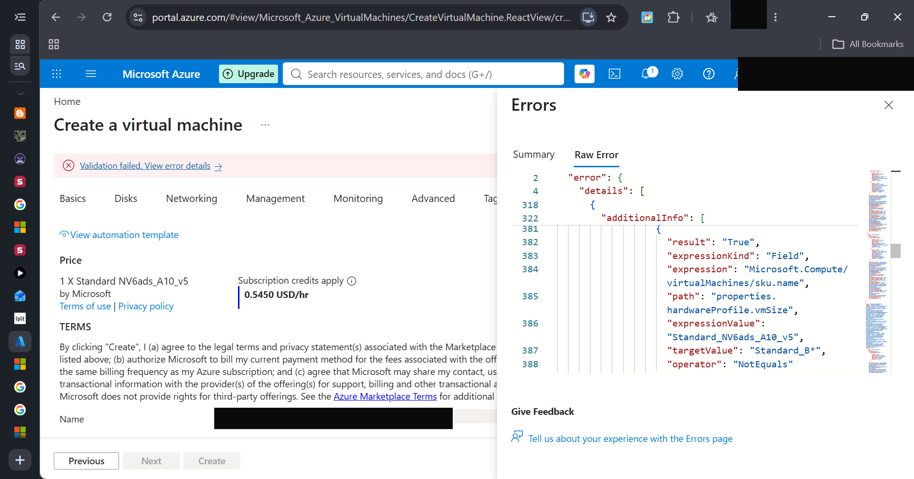
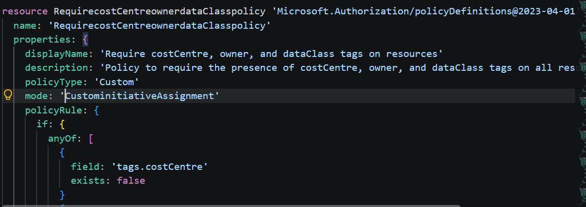
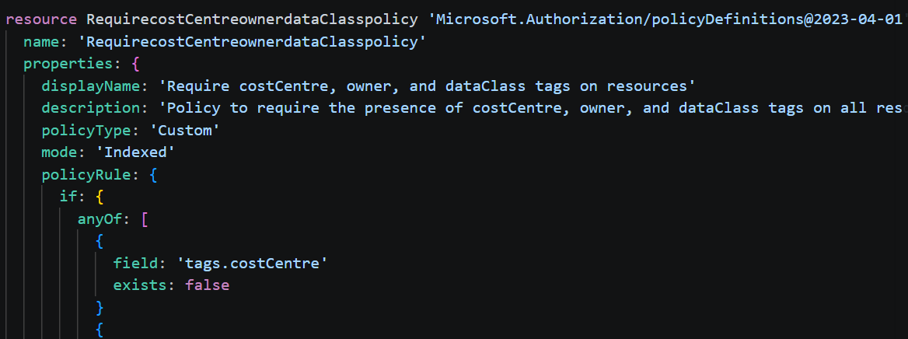
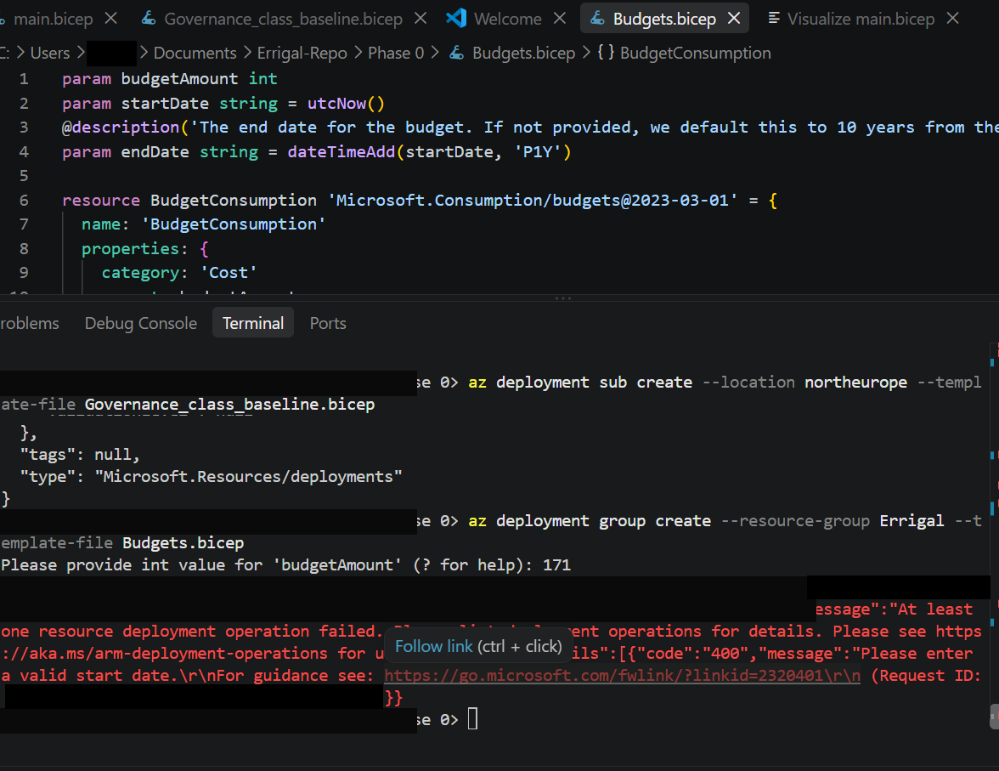

# Errigal

### Phase 0 development

A firewall policy and policy assignment function were created, with the target scope aimed at the subscription level due to the requirement of policies to be present at the management or subscription scope. Created policies before initiative in order to have individual policy ID's for the initiative.

Use of a custom initiative for the defined policies, with a custom initiative assignment after. no parameters or variables were defined at the stage for the governance baseline bicep file as policies usually require minimal to no input from the user, it is the first phase that involves just one environment, and to test if the recorded policy and budget templates can successfully accomplish its task across just one environment before moving on to CI/CD pipeline deployment across ultiple environments. multiple policy assignments were not selected over one custom initiative assignment due to code readability and comprehension purposes.

The resource group for this single-environment test was created via the CLI, working through a region-availability error before landing on North Europe:

Once the custom initiative was assigned, attempting to create a resource that violates it - such as a firewall - was correctly denied:

For the budget bicep file, three parameters are required, the overall budget cost for the operation which is represented as an integer, the start date for the budget consumption monitoring process, and the end date for the budget consumption monitoring process, with a default timeline of 10 years if no end date is specified.

alerts at 30, 60, and 90% of budget consumption were created and implemented to send an email alert to the user's personal email

After the creation of the policies and budgets bicep file, during deployment, an error in specification led to multiple failed deployments, with policies containing fields which used values like sku.name and sku.tier instead of the resource type prepended to the values, after some research, the source of the error was found and fixed, and the deployment was successfully published.

After the successful deployment of the custom initiative, the budget file was similarly deployed, but it failed due to the requirement of specific tags by the policy for any deployed resource, this was due to a specification of an all mode in the policy bicep file, requiring even the budgets to get assigned tags.

the tags policy was then changed from an all mode to an indexed mode.

This fixed the prolem, but another problem was introduced, an invalid start date, it was discovered that budgets start date must always be the first of the month.

### Phase 1 Development

After the successful deployment of the policy and budget templates, the structure of the project was changed, an infrastructure folder was created, which contained modules and environment subfolders, this was done to make the bicep templates modular and to create parameter files for the varying modules that define their input. in the creation of parameters in the governance baseline policy file, all input values were converted to parameters, a similar process was made for the budget bicep file. outputs were used on the governance baseline policy and budget files which were then routed to module declarations in the main.bicep file, with the main.bicep file having a targetscope set to subscription.

After setting that up, my next step was to create identity for the errigal project, i went with a user assigned managed identity federated credential rather than Microsoft EntraID due to priviledge constraints. my first step was to navigate to the azure portal, then search for managed identities which was located under services. i then created a UAMI and assigned it to my errigal resource group. Then i tried to assign a role to the created UAMI, in order to do this, i had to create an identity module that pushes the permissions for the UAMI on a separate pipeline than the Github Actions due to security best practices.

For the identity module, i didn't wire it into the main.bicep as it would then have access to the Microsoft.Authorisation/roleDefinitions/write, the exact architecture design that prompted me to create two separate pipelines for identity and infrastructure.  the identity file contained the secondary and primary managed identities, federated credentials as strings, and role based access control assignments to the created managed identities. for the roles, i created custom roles which grow over time and only gives access to the required resources at the time it should have them, to adhere to least privilege security best practices.

ater assigning the roles through bicep and Github actions, in order to add a federated credential, i had to input my organisation and repo id, this prompted me to inspect the page source in my selected repo and query an in built ai for the details. i then ceated secrets in the selected repo containing the client_id, sub_id, and tenant_id.

due to my design architecture which requires a merge from the side branch to the main branch through what-if commands, i created two federated credentials, during this process, i ran into a scope definition constraint, with federated credential and UAMI resources needed to be defined at the resource group level and custom role and role assignments needed to be defined at the subscription level, prompting me to create two separate files and reference the resources file as a module inside the main identity file. i then created an identity.bicepparam file which i stored in my env to ensure lack of redundancy.

I cloned the private repo to my local machine, created a .github/workflows directory for my github actions workflow in the .yaml format. 

in the yaml, i created an azure cli github actions deployment workflow, i then set the branches to main and sidem corresponding to the github branches, i then used a condition operator that made use of the unique client ID for each managed identity to serve as the clauses for each condition. i then specified the file to be deployed.

I then moved the main.bicep file to my private repo for deployment through git rm, co and cd commands, then i copied the governance_class_baseline and budgets bicep files to the private repo as they had been referenced by the main.bicep file.

After deploying the bicep file through github actions, it failed due to a lack of Microsoft.Resources deployments permissions, prompting me to add a contributor role alongside the already assigned user access management role. After assigning a contributor role, it still failed due to a misnamed resource group, after that was corrected, it finally worked, bring an end to the 1st phase.

After a while, it was decided that having two separate repositories for the same project which didn't provide any additional security benefits was not worth it operationally, prompting me to rewire the secrets in the public repo, change the repo id of the managed identities on azure, and renavigate the directories of main.bicep. as the project was a subfolder inside the repo and not the repo itself, it changed how the .yml file had to be filtered for and how the main.bicep file had to be navigated to. 
